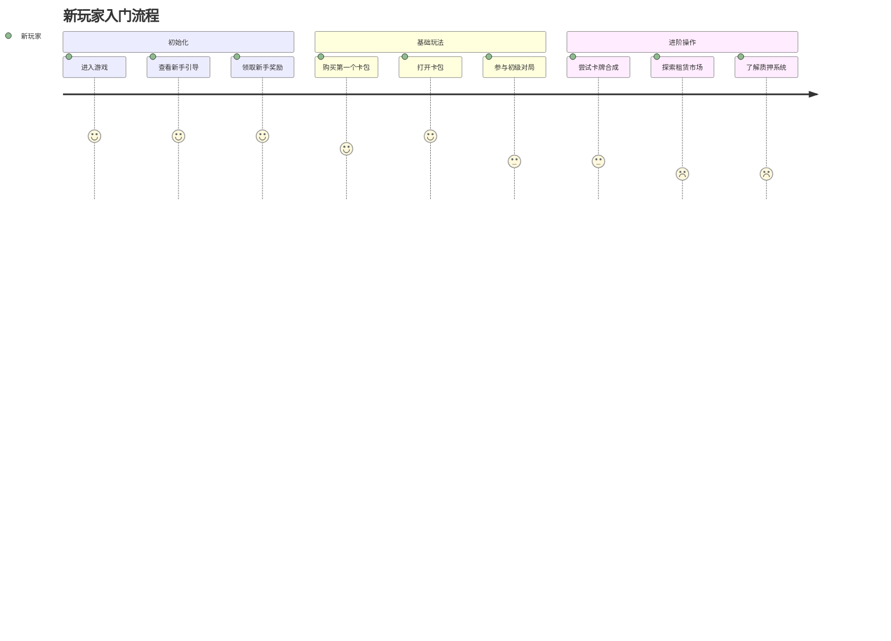
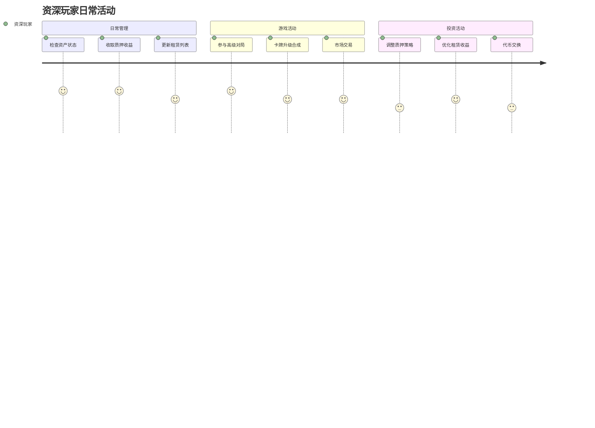
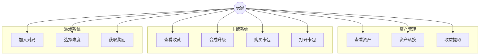
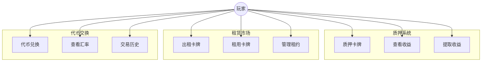
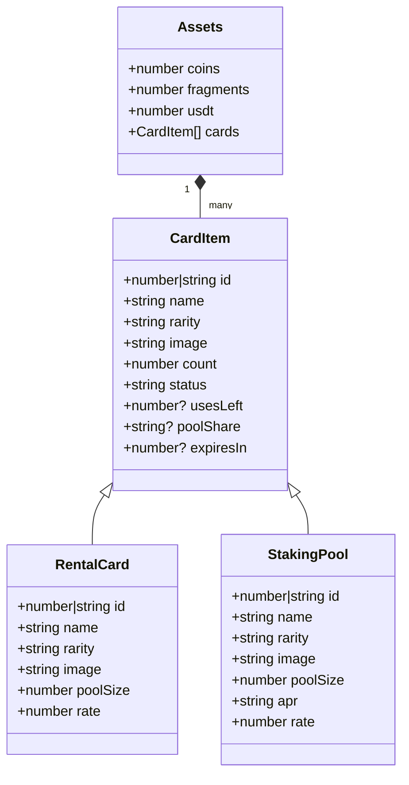
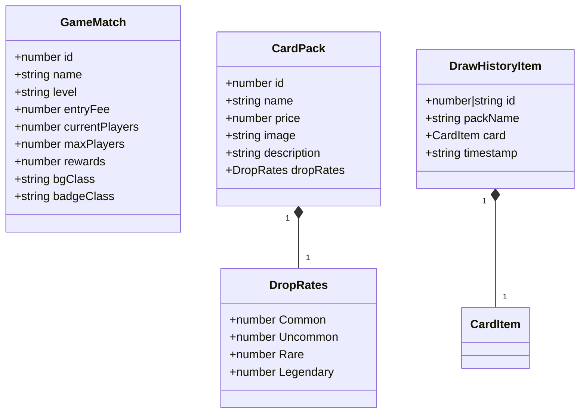
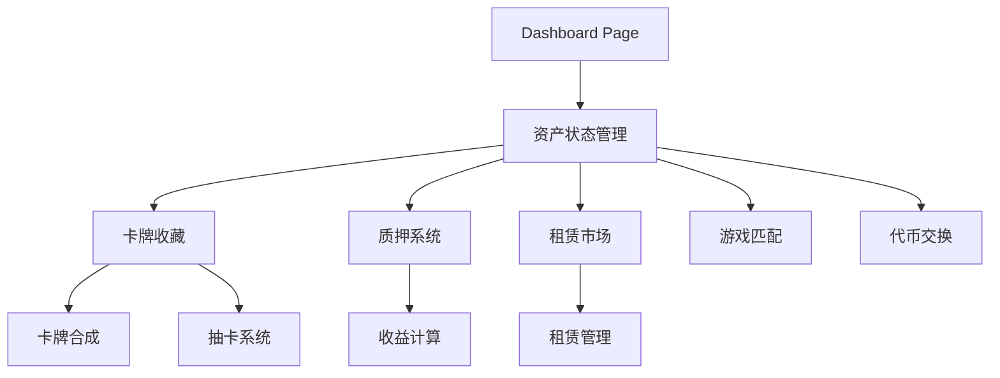

## 模块概述

horizon 模块是 catastrophe-genesis 项目的核心用户界面中心，提供了游戏内所有主要功能的访问入口。该模块整合了卡牌收藏、游戏匹配、质押系统、租赁市场和代币交换等关键功能，为玩家提供了一个统一的游戏管理界面。

## 核心功能

- **资产管理**: 提供玩家代币（Coins、Fragments、USDT）和卡牌资产的实时查看和管理功能
- **卡牌系统**: 包含卡牌收藏展示、卡牌合成、抽卡系统以及卡牌升级功能
- **经济系统**: 集成代币交换、卡牌租赁市场和质押池等 GameFi 核心经济功能
- **游戏匹配**: 提供不同级别（初级、中级、高级）的游戏匹配功能
- **质押系统**: 支持卡牌质押获取收益，包含不同稀有度的质押池和收益率
- **租赁市场**: 允许玩家租借和出租卡牌，支持灵活的租期和使用次数设置

## 用户旅程

### 新玩家入门旅程



### 资深玩家日常旅程



## 用例图

### 核心功能用例



### 经济系统用例



## 对象结构

### 资产系统类图



### 游戏系统类图



## 关键组件

### 页面组件
- **page.tsx**: 主面板页面组件，整合所有子功能模块，管理全局状态和用户交互逻辑

### 功能组件
- **card-collection.tsx**: 卡牌收藏展示组件，管理玩家拥有的卡牌
- **card-synthesis-gacha.tsx**: 卡牌合成和抽卡系统组件，处理卡牌升级和获取逻辑
- **card-staking-pools.tsx**: 质押池组件，管理卡牌质押和收益计算
- **card-rental-marketplace.tsx**: 租赁市场组件，处理卡牌租赁相关功能
- **game-matches.tsx**: 游戏匹配组件，展示可用游戏房间和匹配功能
- **exchange.tsx**: 代币交换组件，处理不同代币间的兑换功能

### 辅助组件
- **header.tsx**: 顶部导航栏组件，显示用户信息和主要功能入口
- **welcome.tsx**: 欢迎界面组件，展示用户状态和快速操作入口
- **dialog-modal.tsx**: 通用对话框组件，用于用户交互确认
- **drawn-card.tsx**: 抽卡结果展示组件，显示新获得的卡牌

## 依赖关系

### 内部依赖
- **@/app/types**: 提供全局类型定义，包括资产、卡牌、对话框等接口
- **@/components/ui**: 使用项目通用 UI 组件库
- **@/hooks**: 使用自定义 hooks，如 useMobile 用于响应式适配

### 外部依赖
- **React**: 核心框架依赖
- **Next.js**: 应用框架，提供路由和客户端渲染支持
- **Lucide React**: 图标库
- **Tailwind CSS**: 样式框架

## 使用示例

```typescript
// 初始化 Dashboard 页面
import DashboardPage from './dashboard/page'

// 渲染主面板
<DashboardPage />

// 处理卡牌质押
const handleStakeCard = (card: StakingPool) => {
  // 检查用户拥有的卡牌
  const userCard = assets.cards.find(c => c.name === card.name)
  if (!userCard || userCard.count === 0) {
    setDialog({
      open: true,
      title: "质押失败",
      description: "您没有足够的卡牌进行质押",
      type: "error"
    })
    return
  }
  // 打开质押输入对话框
  setDialog({
    open: true,
    title: "质押卡牌",
    description: `请输入要质押的 ${card.name} 数量`,
    type: "stakeInput",
    confirmAction: (amount) => confirmStakeCard(card, amount!, userCard)
  })
}
```

## 架构说明

Dashboard 模块采用组件化架构，通过状态提升和属性传递实现组件间通信。主要数据流如下：



- 采用 Next.js App Router 架构
- 使用客户端组件确保实时交互体验
- 实现模块化设计，便于功能扩展和维护
- 统一的状态管理和事件处理机制
- 响应式设计支持多设备适配 